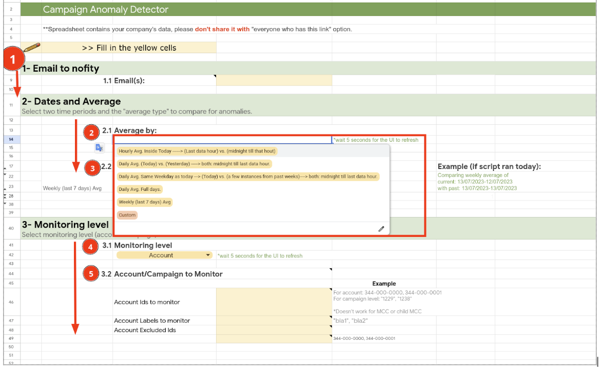
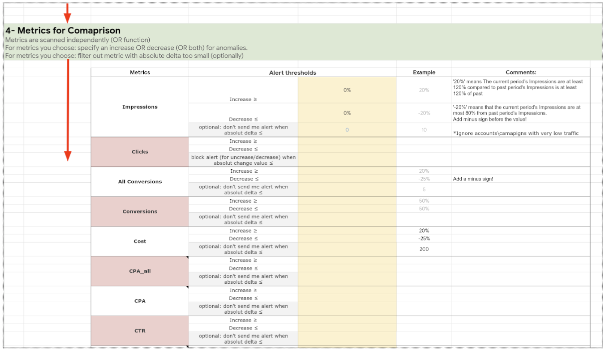
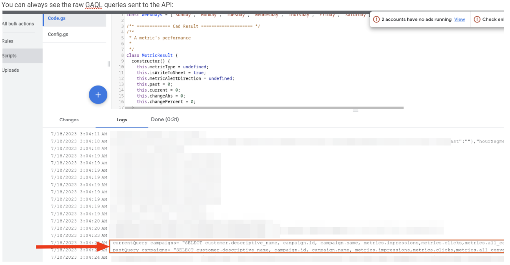
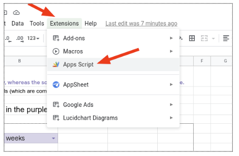
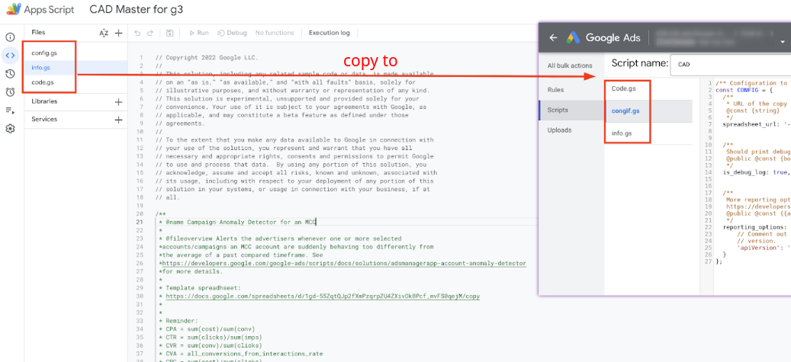

# CAD - Campaign Anomaly Detector

A simple ad script solution that monitors accounts and campaigns for anomalies in various metrics.
An `anomaly` is a significant increase/decrease between past and current time lengths. 
CAD can be scheduled to run recurringly and automatically. It will send the users emails when anomalies are caught.

The [user guide](https://docs.google.com/document/d/1PZZcCjLrg70d5Kj0Mr87ARAk2Q0dPook8950Fna6cSk/edit#heading=h.vgol1uz8ixf6) contains the link to the latest spreadsheet to use!

 

# Project owners

- rsela@google.com
- omril@google.com
- meiravshaul@google.com
- Dev:
- eladb@google.com

 
 

# Key Components

The solution is comprised of:

1. A spreadsheet with 3 tabs:

  * **Welcome tab:** A disclaimer, a link to the latest user guide and release notes.
   
  * **Input tab:** Here you set the monitoring parameters that will be used by the ads script.
   
  * **Results tab:** Each line shows the metrics for entities that had an anomaly.

2. An Ad Script - to call the google-Ads API.
   
   The `ad script` is saved in the `app script editor` (menu bar `Extensions > app-script`), but needs to be copied and pasted into your Google Ads account (script view). Copy the files `Code.gs` and `Config.gs` into your `Google-ads > script` view. Note: override the exisiting template code (en empty `main` function).
 
 

# CAD versions
 

## CAD v2 (August 2023)
* Tutorial [video](http://screencast/cast/NDk1MzY4MTcyOTQyMTMxMnwyODY2NTllOS02MQ)
* Copy the spreadsheet from within the [user guide](https://docs.google.com/document/d/1PZZcCjLrg70d5Kj0Mr87ARAk2Q0dPook8950Fna6cSk/edit#heading=h.320s0cab7juu).

 

#### Features
* Simplified and more interactive UI
* Three new built-in time-length comparisons:
   
    * `Within Today`: comparing last-hour (with data) vs. hourly average of all the hours today before it.
   
    * `Today vs. Yesterday`: Since today data is not finished, the comparison would be midnight till last data hour for both days.
   
    * `Today vs. daily average of past instances of same weekday as today`: Since today data is not finished, the comparison would be midnight till last data hour for every past same weekday.

* Tip: You can click on "logs" tab in G-Ads script UI. Search for the text `current query` and `past query` to see what queries were sent to the Google Ads API. In the same way you can see `current results` and `past results` for the raw responses from Google Ads API.

 
 

### Differences between CAD1 and CAD2

* Interactive dropdown with pre-built options.
* Ability to monitor today (not a full day) against a few past options.
* More metrics to monitor.
* New texts and tooltips.
* Email coloring.
 
 

## CAD v1 (2021) -Not supported anymore
* Tutorial [video](https://www.google.com/url?q=https://drive.google.com/file/d/1UyCuo_n9XQ6U9E1QSYaEBKKf9y6eYDgv/view?resourcekey%3D0-3I4BSEVo58qavsjVwF1pPQ&sa=D&source=docs&ust=1652738916206829&usg=AOvVaw1pQVmP4fBvjpDekksRGEBZ)
* Copy this [spreadsheet](https://docs.google.com/spreadsheets/d/1CdglmgBla6fyYfopxaQE2Uac7Z-1o9BAhx35ixxgu48/copy).
 

#### Features
* Allows comparing custom past and current time lengths.
* Monitor account level and/or campaign level.
* Can filter out metrics with too low (insignificant) absolute numbers.
* Various metrics.
* Define upper and lower change threshold as anomalies.
 
 

# Run

1. Make a copy of the relevant spreadsheet.
   
2. Copy its URL and paste it later (in Google Ads script UI), so that ads-script will use the spreadsheet as an input/output page.
   
3. Rename the spreadsheet.
   
4. Fill the inputs and thresholds in the **"Input"** tab, yellow cells.

* Tip: For the first few runs, try to monitor only a few entities.

    * This is for you to try out the tool.

    * The script has a 30-minute timeout, so it's better not to monitor all the entities using the same script+sheet instance.

    * Load balance it with a few script+sheet instances.

5. Open your MCC in G-Ads UI website.

* Tip: The script runs from an MCC to be able to monitor all its children. But it can monitor only non-MCC accounts and their campaigns.
   
6. Create a new script. Name it.
   
7. Delete its template content.
   
8. Replace it with the code that appears in `Extensions > Apps script`.

   
9. Paste the sheet's URL in `Config.gs`.
   
10. Run the script once ("preview").
   
11. Authorize the popup.
   
12. Run the script again ("preview").
   
12. Schedule the script to run every day.
   
13. Results will appear in the spreadsheet on the **"Results"** tab.

 
 

# License

Apache Version 2.0
See [LICENSE](LICENSE)
 
 

# Disclaimer

**This is not an officially supported Google product.**
Copyright 2021 Google LLC. This solution, including any related sample code or data, is made available on an “as is,” “as available,” and “with all faults” basis, solely for illustrative purposes, and without warranty or representation of any kind. This solution is experimental, unsupported and provided solely for your convenience. Your use of it is subject to your agreements with Google, as applicable, and may constitute a beta feature as defined under those agreements. To the extent that you make any data available to Google in connection with your use of the solution, you represent and warrant that you have all necessary and appropriate rights, consents and permissions to permit Google to use and process that data. By using any portion of this solution, you acknowledge, assume and accept all risks, known and unknown, associated with its usage, including with respect to your deployment of any portion of this solution in your systems, or usage in connection with your business, if at all.
